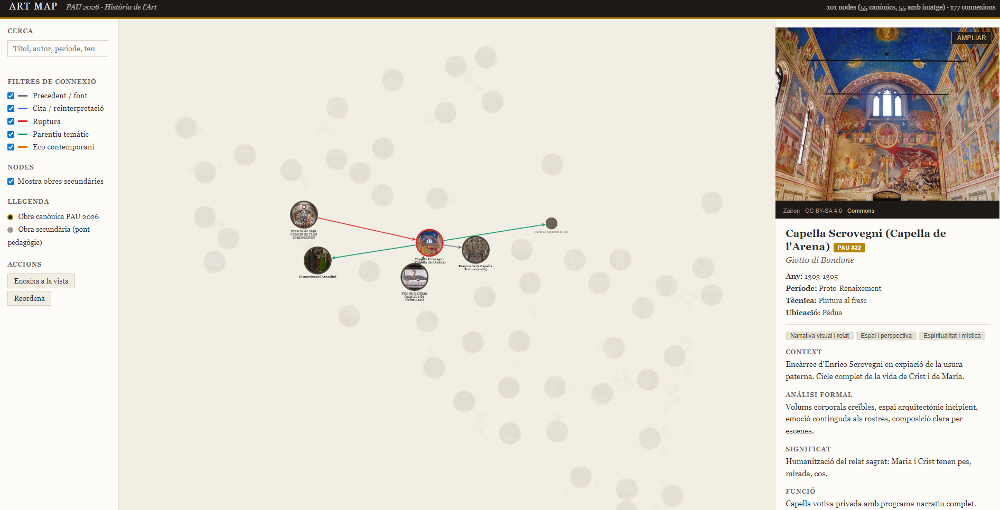

# Art Map

Xarxa interactiva de les **55 obres** del temari d'Història de l'Art de les PAU 2026 (Catalunya), enriquida amb **46 obres pont** secundàries i **177 connexions** classificades en 5 tipus pedagògics: *precedent*, *cita*, *ruptura*, *parentiu* i *eco contemporani*.

Pensat per a **2n de batxillerat**: en comptes d'estudiar les obres aïlladament, es presenten com una xarxa on cada una dialoga amb el seu precedent, els seus ecos posteriors i les obres coetànies. La idea és que l'alumnat construeixi memòria per *relacions*, no per fitxa.

[](https://aaronfortuno.github.io/art-map/)

**Demo en línia**: <https://aaronfortuno.github.io/art-map/>

També és **instal·lable com a PWA**: des del mòbil o l'ordinador, "Afegeix a la pantalla d'inici" / "Instal·la l'aplicació". Funciona sense connexió un cop carregada la primera vegada.

---

## Característiques

### Exploració del graf
- **101 nodes** (55 canòniques PAU + 46 ponts secundaris) amb imatge, any, autor, tècnica, ubicació, anàlisi desenvolupada en 4 apartats i preguntes contrafactuals
- **177 connexions tipificades** amb nota pedagògica per a cadascuna
- **Cerca en calent** per títol, autor, any, període o tema
- **Filtres combinables** en tres nivells: tipus de connexió (5), períodes (29), temes (30)
- **Dues disposicions**: força dirigida (xarxa) i cronològica (X per any, Y per carril)
- **Zoom intel·ligent** a la roda: animat, amb cursor com a pivot; les vores i les etiquetes mantenen la mida en pantalla
- **Bloom a la selecció**: els veïns del node clicat es separen suaument per llegir-se sense encavalcar-se
- **Deep linking** (`#node/id`) i **botó "Copiar enllaç"** per compartir una obra concreta

### Fitxa de cada obra
- Imatge, metadades i anàlisi en 4 camps (context, anàlisi formal, significat, funció)
- Preguntes contrafactuals com a material de debat
- Perspectiva de gènere i no-eurocèntrica incorporades (13 artistes dones, 4 obres no-occidentals, mandat del Decret 171/2022)
- **Mode pantalla completa** amb imatge gran i anàlisi a la banda dreta
- **Caveats pedagògics** per a les obres sota drets d'autor (rèplica, fotografia contextual, retrat) amb explicació transparent

### Mode presentació (per a docents)
- Afegeix obres al mapa a una **seqüència de diapositives** amb el botó "+"
- Reordena arrossegant, elimina amb ×
- **Importa / exporta** la seqüència com a JSON per preparar múltiples sessions
- **Vista a pantalla completa fosca** amb imatge gran + anàlisi + navegació per fletxes (← → Espai Home End) o botons

### Exportació
- **PDF per node** (única obra, una pàgina)
- **PDF del temari PAU** (55 obres en un dossier)
- **PDF complet** (101 obres: canòniques + ponts)

### Temes i accessibilitat
- **Tema clar / fosc** commutable (persistent, respecta *prefers-color-scheme*)
- **Navegació per teclat** completa (Tab/Enter/`/`/Esc i arrows en presentació)
- **Responsive** amb drawer mòbil (*hamburger menu* i bottom sheet per a detalls)
- **Fons decoratiu** subtil: xarxa esparsa de punts i arestes amb parallax, com a recordatori que el temari és una selecció

## Dreceres de teclat

| | |
|---|---|
| `Tab` / `Shift`+`Tab` | Cicle entre les 55 canòniques (vora blava = focus teclat) |
| `Enter` | Fixa el node enfocat (equivalent a un clic) |
| `/` | Focus a la cerca |
| `Esc` | Pela una capa: cerca → focus teclat → pin |
| `?` (botó) | Obre la guia ràpida integrada |
| **En mode presentació** | |
| `←` / `→` | Anterior / següent |
| `Espai` | Següent |
| `Home` / `End` | Primera / última |
| `Esc` | Sortir al mode preparació |

## Prova-ho localment

Només cal un servidor estàtic. Amb Python:

```sh
python -m http.server 5174
```

I obre [`http://localhost:5174/`](http://localhost:5174/). No hi ha *build step*: Cytoscape.js es carrega via CDN.

> Nota: el service worker (mode offline) requereix HTTPS o localhost. Amb `file://` no es registra.

## Estructura del contingut

```
├── index.html · app.js · styles.css     aplicació
├── sw.js                                 service worker (PWA offline)
├── manifest.webmanifest                  instalabilitat PWA
├── favicon.svg · favicon-{192,512}.png   icones
├── data/
│   ├── seed.json                         nodes, arestes, períodes, temes
│   ├── images.json                       metadades d'imatges
│   ├── secondary-images.json             imatges per als 46 ponts
│   ├── canonical-works.json              llista oficial PAU 2026
│   ├── secondary-proposals.json          propostes per eixos temàtics
│   ├── copyright-alternatives.json       estratègies per a les 5 obres amb drets
│   └── secondary-copyright-alternatives.json  (anàleg per als ponts)
├── img/                                  imatges locals (~65 MB, 96 fitxers)
├── scripts/                              utilitats Python
├── docs/screenshot.png                   captura de pantalla (README)
├── curriculum.txt                        Decret 171/2022 (marc curricular)
├── ATTRIBUTIONS.md                       crèdits d'imatges per llicència
├── TODO.md                               roadmap pedagògic i tècnic
└── LICENSE                               MIT (codi)
```

## Com s'estenen els continguts

- **Afegir una obra**: nou node a `data/seed.json` (seguir l'esquema de `nodeSchema`) + arestes cap a nodes existents
- **Afegir una imatge**: a `data/images.json` (o `secondary-images.json`), registrar-ne la font; executar `scripts/download_images.py` o `scripts/download_secondary_images.py`
- **Regenerar atribucions**: `python scripts/generate_attributions.py`
- **Regenerar favicons PNG** (si canvia el disseny): `python scripts/generate_favicons.py`

## Tecnologia

- **Visualització**: [Cytoscape.js](https://js.cytoscape.org/) (via CDN, sense bundler)
- **Backend**: cap, 100% estàtic
- **Scripts**: Python 3 estàndard (`urllib`, `json`, `re`) + [Pillow](https://python-pillow.org/) per als favicons
- **PWA**: webmanifest + service worker sense dependències

## Llicències

- **Codi** (`app.js`, `sw.js`, `index.html`, `styles.css`, `scripts/`): [MIT](./LICENSE)
- **Contingut pedagògic** (anàlisis, connexions, preguntes contrafactuals a `data/seed.json`): [CC BY-SA 4.0](https://creativecommons.org/licenses/by-sa/4.0/)
- **Imatges**: llicències mixtes per fitxer. Detall complet a [`ATTRIBUTIONS.md`](./ATTRIBUTIONS.md). Inclouen obres en domini públic, CC BY, CC BY-SA i una imatge sota excepció educativa ([LPI Art. 32](https://www.boe.es/buscar/act.php?id=BOE-A-1996-8930)) per a l'obra de Bill Viola. Totes les imatges que no són lliures corresponen a estratègies alternatives (rèpliques, fotos contextuals o retrats de l'artista) per a obres canòniques encara sota drets d'autor, amb *caveat* explícit a l'aplicació.

Les anàlisis, preguntes i connexions són fruit d'un diàleg iteratiu amb assistents d'IA supervisat pel professor, i es poden reutilitzar i adaptar sota CC BY-SA.

## Estat

Versió **1.0-beta** (2026-04-19): les 101 fitxes tenen imatge + anàlisi desenvolupada + connexions tipificades; el mapa té cerca, tres nivells de filtre, fullscreen, deep linking, layout persistent, mode cronologia, mode presentació, exportació a PDF, navegació per teclat, tema clar/fosc i suport PWA offline. Vegeu [`TODO.md`](./TODO.md) per al que queda pendent (hotspots sobre imatges, revisió pedagògica de connexions i altres millores).

## Autoria

**Aaron Fortuño** · Catalunya, 2026
